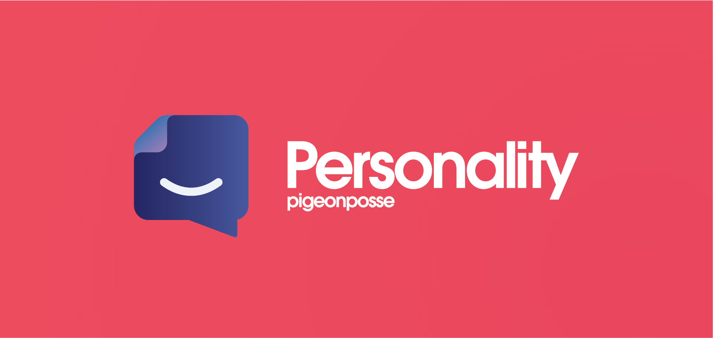
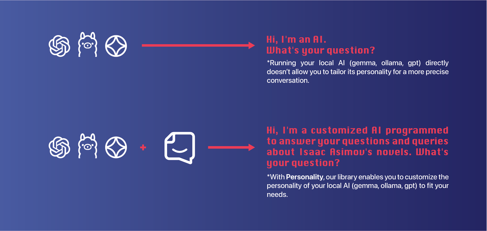

# Personality by _PIGEONPOSSE_

[](https://npmjs.com/package/create-personality)

[](https://pigeonposse.com/)
[](https://pigeonposse.com/?popup=about)
[](https://github.com/pigeon-posse)
[](https://pigeonposse.com/?popup=donate)

[](https://npmjs.com/package/create-personality)
[](https://npmjs.com/package/create-personality)
[](https://npmjs.com/package/create-personality)

## Library/CLI for Crafting and Sustaining AI Personalities



`Personality` is a library designed to customize the personality configuration of AI running locally. It allows users to define and adjust the traits, communication style, and behavior of their AI models in detail, ensuring responses are coherent and aligned with specific project goals. Ideal for developers looking to add a distinctive and human-like touch to their AI applications.

[](https://npmjs.com/package/create-personality)

## Features

- 🧩 Customize your local AI (Gemma, GPT, LLaMA, etc.): Quickly and easily, in just a few seconds.
- 🔧 Simple integration: Seamlessly works with Node.js and other frameworks.
- ⚡ Enhanced performance: Your configurations and data are cached for faster processing in future interactions.
- 🌐 Automatic language detection: Adapts to the language you're using for smooth interaction with your custom AI.
- 💻 Adaptability: Works in any development environment using the [binary](https://github.com/pigeonposse/personality/releases/latest).
- 🌍 Open-source: MIT licensed, available for public use and contributions.

## Personalized AI Setup Form

- ❓What overall tone would you prefer for the AI?
- ❓Choose the level of formality the AI should have:
- ❓Select the main topics the AI should be knowledgeable in (you can choose more than one):
- ❓What level of creativity would you like in the AI's responses?
- ❓What type of humor (if any) should the AI use?
- ❓What level of empathy should the AI show in conversations?
- ❓How should the AI approach complex problems or delicate questions?
- ❓What response length would you prefer?
- ❓Would you like to add any quirks or distinctive behaviors to the AI? (e.g., speaking in metaphors, using pop culture references):
- ❓Describe your overall vision for the AI's personality and areas of interest:

## Prerequisites

- installation of `ollama`

## Installation

To install the library, use npm or yarn:

```bash
# Using npm
npm create personality

# Using pnpm
pnpm create personality

# Using yarn
yarn create personality
```

## ☕ Donate

Help us to develop more interesting things.

[](https://pigeonposse.com/?popup=donate)

## 📜 License

This software is licensed with **[GPL-3.0](/LICENSE)**.

[](/LICENSE)

## 🐦 About us

*PigeonPosse* is a ✨ **code development collective** ✨ focused on creating practical and interesting tools that help developers and users enjoy a more agile and comfortable experience. Our projects cover various programming sectors and we do not have a thematic limitation in terms of projects.

[](https://github.com/pigeonposse)

### Collaborators

|                                                                                    | Name        | Role         | GitHub                                         |
| ---------------------------------------------------------------------------------- | ----------- | ------------ | ---------------------------------------------- |
|  | Alejo |   Author & Development   | [@alejomalia](https://github.com/alejomalia) |
|  | PigeonPosse | Collective | [@PigeonPosse](https://github.com/PigeonPosse) |

<br>
<p align="center">

[](https://pigeonposse.com)
[](https://pigeonposse.com?popup=about)
[](https://pigeonposse.com/?popup=donate)
[](https://github.com/pigeonposse)
[](https://twitter.com/pigeonposse_)
[](https://www.instagram.com/pigeon.posse/)
[](https://medium.com/@pigeonposse)

</p>
